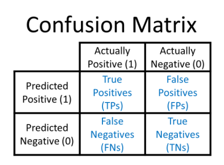
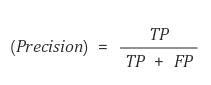
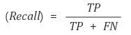
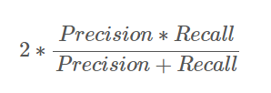

# PRECISION, RECALL, F1SCORE 

학습시 accuracy 뿐 아니라 recall, precision, f1score을 모니터링 할 필요가 있다. <br>

아래와 같이 사용자정의 함수를 생성하고, compile시 활용해주면 된다.

```python
from tensorflow.keras import backend as K

def _recall(y_true, y_pred):

    # 실제값과 예측값 모두 1이면 true positive, 그 개수
    true_positives = K.sum(K.round(K.clip(y_true * y_pred, 0, 1)))

    # 실제값이 1인 개수
    possible_positives = K.sum(K.round(K.clip(y_true, 0, 1)))

    # reacall
    recall = true_positives / (possible_positives + K.epsilon())
    return recall

def _precision(y_true, y_pred):

    true_positives = K.sum(K.round(K.clip(y_true * y_pred, 0, 1)))

    #예측값이 1인 개수
    predicted_positives = K.sum(K.round(K.clip(y_pred, 0, 1)))

    #precision
    precision = true_positives / (predicted_positives + K.epsilon())
    return precision

def _f1(y_true, y_pred):
    precision = _precision(y_true, y_pred)
    recall = _recall(y_true, y_pred)
    return 2*((precision*recall)/(precision+recall+K.epsilon()))

```

```python
# model.compile(loss='binary_crossentropy', optimizer='Adam', metrics=['accuracy',_f1,_precision,_recall])
```


___
## precision, recall, f1score 참고 자료
- confusion metrics <br>

- precision <br>
<br>
  참이라고 탐지 한 것중 실제 참인 데이터의 비율
- recall <br>  
<br>
  실제 참인 데이터중 참이라고 탐지한 데이터의 비율
- f1 score<br>  
 <br>
  recall과 precision의 조화평균